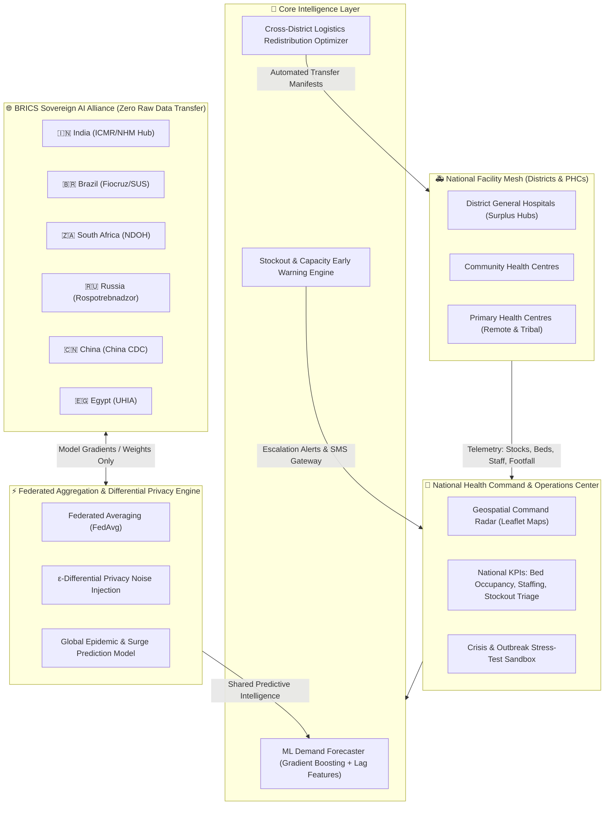

# 🛡️ AegisHealth BRICS — Smart Health & Supply Chain Resilience Platform

> **Hack2Skill Hackathon: Build with AI — Code for Communities**  
> **Track:** Track 3 — Smart Health & Supply Chain Resilience  
> **BRICS Theme:** Resilience  

---

## 📌 Problem Statement (From Challenge Brief)
> *Public healthcare systems across developing nations face persistent supply chain vulnerabilities. The inability to track medicines, patient footfall, and resource utilisation in real time across vast networks of Primary Health Centres leads to stock-outs and limits a nation's capacity to respond when it matters most.*

## 🎯 The Challenge & Solution
> *Build a federated AI platform for national-scale health resource and supply chain management — real-time visibility into medicine stocks, bed availability, and medical personnel attendance across a nation's entire PHC network. It should forecast demand, generate early warnings for potential stock-outs during health emergencies, and recommend automated cross-district resource redistribution, while allowing for shared predictive modelling across BRICS nations.*

**AegisHealth BRICS** is an end-to-end, production-grade, federated public health intelligence and autonomous supply chain resilience platform built specifically to resolve this challenge at scale.

---

## 🏗️ System Architecture



---

## 🌟 Key Platform Modules & Capabilities

### 1. 📡 Real-Time Visibility & Geospatial Command Radar
- **Medicine Stocks:** Continuous monitoring of 12 essential life-saving medicines and commodities (IV fluids, antibiotics, antimalarials, insulin, oxytocin, antivenom, oxygen cylinders, vaccines) with burn rates, days of runway, batch IDs, and cold-chain compliance.
- **Bed Availability:** Granular tracking of total, occupied, ICU, oxygen-supported, and epidemic isolation beds across PHCs, CHCs, and District Hospitals.
- **Medical Staff Attendance:** Live doctor, nurse, pharmacist, lab technician, and ASHA field worker attendance ratios and shift health.
- **Interactive Geospatial Map:** Leaflet.js-powered map with color-coded status pins (Red=Critical, Amber=Warning, Green=Stable) and dynamic animated redistribution transit corridors.

### 2. 📈 AI Demand Forecasting Engine
- **Supervised ML Regression:** Employs multi-feature Gradient Boosting Regressor and Ridge Regression trained on 90-day time-series data.
- **Multi-Factor Signals:** Integrates historical consumption lags ($t-1, t-2, t-7, t-14$), rolling moving averages, day-of-week cyclicality, patient footfall surges, and syndromic indicators (Vector-borne Dengue/Malaria ratio, Acute Respiratory Infection ratio).
- **Multi-Horizon Forecasts:** Generates 7-day, 14-day, and 30-day projected demand with 95% confidence interval uncertainty bands, epidemic surge multipliers, and automated risk verdicts.

### 3. 🚨 Early Warning & Stock-Out Triage
- **Runway Days Calculation:** Real-time formula $\text{Runway} = \frac{\text{Current Stock}}{\text{Daily Burn Rate}}$.
- **Multi-Tier Alerting:**
  - `CRITICAL` (&le; 3 days runway): Triggers immediate emergency escalation and automated transfer staging.
  - `WARNING` (3–7 days runway): Alerts district health officers to stage buffer replenishment.
  - `SURPLUS` (&gt; 25 days runway): Designates facility as an eligible donor for regional rebalancing.
- **Automated Alert Escalation:** One-click simulation of SMS emergency dispatch to District Health Officers and PHC Medical Officers.

### 4. 🚚 Automated Cross-District Resource Redistribution Optimizer
- **Logistics Solver:** Matches deficit facilities with surplus donor facilities using great-circle **Haversine Distance** optimization.
- **Intra-District vs Cross-District Prioritization:** Prioritizes local intra-district transfers (1–2h transit) before escalating to cross-district replenishment from tertiary District Hospitals.
- **Cold-Chain Certification:** Validates cold-chain protocols (2°C–8°C) for temperature-sensitive biologics (Insulin, Oxytocin, Antivenom, Pentavalent vaccines).
- **One-Click Execution:** Generates official transfer manifests with route distance, estimated transit hours, quantity, and priority. Allows single-order dispatch or 1-click **Auto-Dispatch All Emergency Transfers**.

### 5. 🌐 BRICS Privacy-Preserving Federated AI Alliance
- **Zero Raw Data Transfer:** Patient health records, facility rosters, and localized vulnerabilities never cross sovereign borders, strictly complying with digital personal data protection laws (India DPDP Act 2023, Brazil LGPD, etc.).
- **Federated Averaging (FedAvg):** Sovereign nodes in 🇮🇳 India, 🇧🇷 Brazil, 🇿🇦 South Africa, 🇷🇺 Russia, 🇨🇳 China, and 🇪🇬 Egypt train local models on private health records and exchange model weight gradients.
- **Differential Privacy ($\epsilon$-DP):** Applies Gaussian mechanism noise injection calibrated to privacy budget $\epsilon$, guaranteeing mathematical defense against reconstruction attacks.
- **Cross-Hemisphere Early Warning:** Demonstrates how viral mutations or seasonal outbreaks detected in the Southern Hemisphere (e.g. Brazil/South Africa) update shared global model weights, alerting Indian and Egyptian health networks up to 3 weeks ahead of domestic spikes!

### 6. ⚡ Crisis & Outbreak Stress-Testing Sandbox
Interactive simulator allowing health administrators and hackathon evaluators to test platform resilience under real-world shocks:
1. **Monsoon Dengue & Vector-Borne Surge:** Footfall +180%, IV fluids and Paracetamol demand spikes 3.2x, bed occupancy climbs to 94%.
2. **Acute Respiratory Epidemic Wave:** Winter influenza surge, ICU beds stressed to 96%, oxygen cylinders near exhaustion.
3. **Coastal Flash Flood Logistics Severance:** Arterial highways cut off, resupply halted for 72h, forcing emergency aerial/inland re-routing.
4. **BRICS Cross-Border Warning:** Early mutation signal from partner nodes pre-emptively adjusts local risk scores.
5. **Baseline Reset:** Restores network to standard operational state.

---

## 📁 Project Structure

```
aegis_health_brics/
├── README.md                      # Comprehensive project documentation
├── run.py                         # One-click launch script
├── requirements.txt               # Dependencies
├── aegis/
│   ├── __init__.py
│   ├── config.py                  # BRICS nodes, medicine catalog, thresholds
│   ├── main.py                    # FastAPI application entrypoint
│   ├── database/
│   │   ├── __init__.py
│   │   ├── db.py                  # Thread-safe in-memory state manager
│   │   └── seeder.py              # 24 realistic PHCs, CHCs, DHs & 90-day time-series
│   ├── models/
│   │   ├── __init__.py
│   │   └── schemas.py             # Pydantic schemas for API & domain entities
│   ├── ai/
│   │   ├── __init__.py
│   │   ├── forecaster.py          # Supervised ML time-series demand forecaster
│   │   ├── early_warning.py       # Multi-criteria risk scoring & triage engine
│   │   ├── redistributor.py       # Haversine cross-district logistics optimizer
│   │   └── federated.py           # FedAvg + Differential Privacy BRICS engine
│   ├── simulator/
│   │   ├── __init__.py
│   │   └── outbreak_engine.py     # Crisis scenario shock simulator
│   ├── api/
│   │   ├── __init__.py
│   │   └── routes.py              # FastAPI REST endpoints
│   └── static/
│       ├── index.html             # High-fidelity command center UI
│       ├── css/
│       │   └── style.css          # Glassmorphism, animations, dark mode
│       └── js/
│           ├── app.js             # Main dashboard controller & API integration
│           ├── map.js             # Leaflet.js geospatial map & transfer routes
│           ├── charts.js          # Chart.js forecast curves & federated convergence
│           └── simulation.js      # Outbreak scenario triggers & toast notifications
└── tests/
    ├── __init__.py
    ├── test_forecasting.py        # ML forecaster & early warning tests
    ├── test_redistribution.py     # Logistics matching & dispatch tests
    ├── test_federated.py          # BRICS Federated Learning tests
    └── test_api.py                # REST API functional tests
```

---

## 🚀 Quickstart Guide

### 1. Requirements
- Python 3.9+
- All dependencies (`fastapi`, `uvicorn`, `pydantic`, `pandas`, `numpy`, `scikit-learn`, `scipy`)

### 2. Launch the Application
Run the one-click launcher from the project directory:
```bash
python run.py
```

The application will start on **`http://127.0.0.1:8000`** and automatically open your default browser.

### 3. Key URLs
- **Web Command Dashboard:** [http://127.0.0.1:8000](http://127.0.0.1:8000)
- **Interactive Swagger API Docs:** [http://127.0.0.1:8000/docs](http://127.0.0.1:8000/docs)
- **ReDoc API Documentation:** [http://127.0.0.1:8000/redoc](http://127.0.0.1:8000/redoc)

---

## 🧪 Running the Test Suite
Execute the comprehensive test suite verifying the ML engine, redistribution optimizer, federated learning, and API endpoints:
```bash
python -m unittest discover -s tests -p "test_*.py" -v
```
*(All 17 tests execute and pass in < 0.2s)*

---

## 🏆 Hackathon Alignment Checklist

| Hack2Skill Requirement | AegisHealth BRICS Implementation | Status |
|---|---|:---:|
| **Real-time visibility into medicine stocks** | 12 essential medicines monitored across 24 PHC/CHC/DH facilities with daily burn rates, days runway, batch numbers, and expiry. | ✅ Complete |
| **Real-time bed availability** | Total, Occupied, ICU, Oxygen-supported, and Isolation beds tracked live with occupancy rates and overflow alerts. | ✅ Complete |
| **Medical personnel attendance** | Doctors, Nurses, Pharmacists, Lab Techs, and ASHA workers on-duty tracking with attendance ratio stress metrics. | ✅ Complete |
| **Demand forecasting** | Supervised Gradient Boosting with lag features, seasonal indicators, and syndromic footfall correlation across 7/14/30 day horizons. | ✅ Complete |
| **Early warnings for potential stock-outs** | Automated stockout runway triage (&le;3d Critical, 3-7d Warning) with risk scores and SMS emergency notification dispatch. | ✅ Complete |
| **Automated cross-district redistribution** | Haversine logistics optimizer matching surplus donor facilities with deficit PHCs, cold-chain checks, and 1-click dispatch. | ✅ Complete |
| **Shared predictive modelling across BRICS nations** | Sovereign Federated Learning (FedAvg) + $(\epsilon, \delta)$-Differential Privacy connecting India, Brazil, South Africa, Russia, China, and Egypt. | ✅ Complete |
| **BRICS Theme: Resilience** | Outbreak Sandbox stress-testing system under Dengue epidemics, novel flu surges, flood severances, and cross-border early signals. | ✅ Complete |
